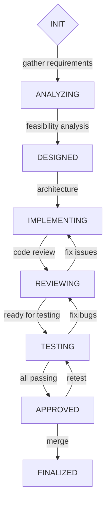

# State Machine Workflow Skill

## Purpose

Implement structured workflows with **explicit state transitions** using the **Graph of Thoughts (GoT) pattern**. This enables clear visualization, progress tracking, and reliable execution of multi-phase processes.

## When to Use

- **Feature Development** - Features with multiple stages (analysis → design → implementation → review)
- **Testing Workflows** - Unit → Integration → E2E → Approval phases
- **Release Management** - Planning → Building → Testing → Deploying → Monitoring
- **Approval Processes** - Draft → Review → Approved → Published
- **User Onboarding** - Initial → Active → Verified → Premium
- **Long-Running Tasks** - CI/CD pipelines, batch processing

## The Graph of Thoughts Pattern

**GoT** provides a graph of states with explicit transitions:

```
[INIT] → [ANALYZING] → [DESIGNED] → [IMPLEMENTING]
    ↓                     ↓             ↓
[READY] ← [APPROVED] ← [REVIEWING] ← [TESTING]
    ↓
[FINALIZED]
```

Each state has:
- Clear purpose and responsibilities
- Defined entry/exit criteria
- Valid transitions to other states
- Optional sub-workflows

## Predefined Workflows

### Workflow 1: Feature Development

```
INIT → ANALYZING → DESIGNED → IMPLEMENTING → REVIEWING → TESTING → APPROVED → FINALIZED
```

**States:**
1. **INIT** - Requirements gathered, project initialized
2. **ANALYZING** - Understanding requirements, technical feasibility
3. **DESIGNED** - Architecture, API design, database schema
4. **IMPLEMENTING** - Code implementation
5. **REVIEWING** - Code review, self-reflection (Ralph Loop)
6. **TESTING** - Unit, integration, E2E tests
7. **APPROVED** - Review passed, ready for merge
8. **FINALIZED** - Merged, deployed

### Workflow 2: Testing Process

```
INIT → UNIT_TESTING → INTEGRATION_TESTING → E2E_TESTING → APPROVED → FINALIZED
```

**States:**
1. **INIT** - Test plan created, test data prepared
2. **UNIT_TESTING** - Unit tests written and passing
3. **INTEGRATION_TESTING** - Tests for component interactions
4. **E2E_TESTING** - End-to-end tests in staging environment
5. **APPROVED** - All tests passing
6. **FINALIZED** - Test coverage report generated

## State Machine Implementation

### Kotlin DSL

```kotlin
enum class FeatureState {
    INIT,
    ANALYZING,
    DESIGNED,
    IMPLEMENTING,
    REVIEWING,
    TESTING,
    APPROVED,
    FINALIZED
}

data class FeatureWorkflow(
    var state: FeatureState = FeatureState.INIT,
    var progress: Double = 0.0,
    var subWorkflow: SubWorkflow? = null
) {
    fun canTransitionTo(newState: FeatureState): Boolean {
        return allowedTransitions[state]!!.contains(newState)
    }

    fun transitionTo(newState: FeatureState) {
        if (!canTransitionTo(newState)) {
            throw InvalidTransitionException("Cannot transition from $state to $newState")
        }
        state = newState
        progress = calculateProgress()
    }

    private fun calculateProgress(): Double {
        val percentage = state.ordinal * 12.5  // 8 states × 12.5% each
        return subWorkflow?.let {
            percentage + subWorkflow.progress * 12.5
        } ?: percentage
    }

    companion object {
        private val allowedTransitions = mapOf(
            FeatureState.INIT to setOf(FeatureState.ANALYZING, FeatureState.READY),
            FeatureState.ANALYZING to setOf(FeatureState.DESIGNED, FeatureState.INIT),
            FeatureState.DESIGNED to setOf(FeatureState.IMPLEMENTING, FeatureState.ANALYZING),
            FeatureState.IMPLEMENTING to setOf(FeatureState.REVIEWING, FeatureState.DESIGNED),
            FeatureState.REVIEWING to setOf(FeatureState.TESTING, FeatureState.DESIGNED, FeatureState.IMPLEMENTING),
            FeatureState.TESTING to setOf(FeatureState.APPROVED, FeatureState.REVIEWING, FeatureState.IMPLEMENTING),
            FeatureState.APPROVED to setOf(FeatureState.FINALIZED, FeatureState.TESTING, FeatureState.REVIEWING),
            FeatureState.FINALIZED to setOf()
        )
    }
}
```

### JavaScript/TypeScript DSL

```typescript
enum class FeatureState {
  INIT,
  ANALYZING,
  DESIGNED,
  IMPLEMENTING,
  REVIEWING,
  TESTING,
  APPROVED,
  FINALIZED
}

class FeatureWorkflow {
  private state: FeatureState = FeatureState.INIT;
  private progress: number = 0;
  private subWorkflow?: SubWorkflow;

  canTransitionTo(newState: FeatureState): boolean {
    return this.allowedTransitions.get(this.state)?.has(newState) ?? false;
  }

  transitionTo(newState: FeatureState): void {
    if (!this.canTransitionTo(newState)) {
      throw new InvalidTransitionException(
        `Cannot transition from ${this.state} to ${newState}`
      );
    }
    this.state = newState;
    this.progress = this.calculateProgress();
  }

  private calculateProgress(): number {
    const percentage = this.state * 12.5;
    return this.subWorkflow 
      ? percentage + this.subWorkflow.progress * 12.5
      : percentage;
  }

  static allowedTransitions: Map<FeatureState, Set<FeatureState>> = new Map([
    [FeatureState.INIT, new Set([FeatureState.ANALYZING, FeatureState.READY])],
    [FeatureState.ANALYZING, new Set([FeatureState.DESIGNED, FeatureState.INIT])],
    [FeatureState.DESIGNED, new Set([FeatureState.IMPLEMENTING, FeatureState.ANALYZING])],
    [FeatureState.IMPLEMENTING, new Set([FeatureState.REVIEWING, FeatureState.DESIGNED])],
    [FeatureState.REVIEWING, new Set([FeatureState.TESTING, FeatureState.DESIGNED, FeatureState.IMPLEMENTING])],
    [FeatureState.TESTING, new Set([FeatureState.APPROVED, FeatureState.REVIEWING, FeatureState.IMPLEMENTING])],
    [FeatureState.APPROVED, new Set([FeatureState.FINALIZED, FeatureState.TESTING, FeatureState.REVIEWING])],
    [FeatureState.FINALIZED, new Set()]
  ]);
}
```

## Integration Pattern

### Agent Implementation

```kotlin
class FeatureAgent {
    private val workflow = FeatureWorkflow()

    fun startFeature() {
        workflow.transitionTo(FeatureState.ANALYZING)
        analyzeRequirements()
    }

    fun analyzeRequirements() {
        workflow.transitionTo(FeatureState.DESIGNED)
        designArchitecture()
    }

    fun designArchitecture() {
        workflow.transitionTo(FeatureState.IMPLEMENTING)
        implementFeature()
    }

    fun implementFeature() {
        workflow.transitionTo(FeatureState.REVIEWING)
        reviewCode()
    }

    fun reviewCode() {
        if (shouldTransitionToTesting()) {
            workflow.transitionTo(FeatureState.TESTING)
            runTests()
        } else {
            workflow.transitionTo(FeatureState.IMPLEMENTING)
            implementFeature()
        }
    }

    fun runTests() {
        if (allTestsPassing()) {
            workflow.transitionTo(FeatureState.APPROVED)
        } else {
            workflow.transitionTo(FeatureState.REVIEWING)
            fixBugs()
        }
    }

    fun shouldTransitionToTesting(): Boolean {
        return codeReviewPassed() && documentationComplete()
    }

    fun allTestsPassing(): Boolean {
        return unitTestsPass() && integrationTestsPass() && e2eTestsPass()
    }
}
```

## Conditional Transitions

### Based on Criteria

```kotlin
fun reviewCode() {
    val reviewPassed = performCodeReview()

    if (reviewPassed) {
        workflow.transitionTo(FeatureState.TESTING)
        runTests()
    } else {
        // Stay in REVIEWING to fix issues
        logReviewIssues()
        fixCodeIssues()
    }
}

fun runTests() {
    val testsPassed = executeTestSuite()

    if (testsPassed) {
        workflow.transitionTo(FeatureState.APPROVED)
    } else {
        // Move back to IMPLEMENTING to fix bugs
        workflow.transitionTo(FeatureState.IMPLEMENTING)
        fixTestFailures()
    }
}
```

### Sub-Workflow Support

```kotlin
fun implementFeature() {
    workflow.transitionTo(FeatureState.IMPLEMENTING)

    val uiWorkflow = SubWorkflow("UI Implementation", progress = 0.0)
    workflow.subWorkflow = uiWorkflow

    // Implement UI
    buildFrontend()
    uiWorkflow.progress = 0.3

    // Implement Backend
    buildBackend()
    uiWorkflow.progress = 0.6

    // Test integration
    testIntegration()
    uiWorkflow.progress = 0.9

    workflow.subWorkflow = null
    workflow.transitionTo(FeatureState.REVIEWING)
}

data class SubWorkflow(
    val name: String,
    var progress: Double = 0.0
)
```

## Visualization

### Mermaid Diagram



### Progress Tracking

```kotlin
class FeatureProgress {
    fun getProgressPercentage(): Double {
        return workflow.progress
    }

    fun getCurrentState(): FeatureState {
        return workflow.state
    }

    fun getStateDescription(): String {
        return when (workflow.state) {
            FeatureState.INIT -> "Initializing feature"
            FeatureState.ANALYZING -> "Analyzing requirements"
            FeatureState.DESIGNED -> "Designing architecture"
            FeatureState.IMPLEMENTING -> "Implementing code"
            FeatureState.REVIEWING -> "Reviewing code"
            FeatureState.TESTING -> "Running tests"
            FeatureState.APPROVED -> "Ready for merge"
            FeatureState.FINALIZED -> "Merged and deployed"
        }
    }
}
```

## Real-World Example

### User Onboarding Workflow

```kotlin
enum class UserOnboardingState {
    INIT,
    CREATED,
    WELCOME_SENT,
    EMAIL_VERIFIED,
    PROFILE_SETUP,
    ACTIVE
}

class UserOnboardingWorkflow {
    private var state = UserOnboardingState.INIT
    private val subWorkflows = mutableListOf<SubWorkflow>()

    fun startOnboarding(userId: String) {
        state = UserOnboardingState.CREATED
        sendWelcomeEmail(userId)
        state = UserOnboardingState.WELCOME_SENT
    }

    fun verifyEmail(token: String) {
        if (verifyToken(token)) {
            state = UserOnboardingState.EMAIL_VERIFIED
            promptForProfileSetup(userId)
        } else {
            sendTokenError(userId)
        }
    }

    fun completeProfileSetup(profileData: ProfileData) {
        if (profileData.valid) {
            state = UserOnboardingState.PROFILE_SETUP
            saveUserProfile(profileData)
            state = UserOnboardingState.ACTIVE
            notifyActivation(userId)
        }
    }
}

// Workflow visualization
val workflow = UserOnboardingWorkflow()
val states = UserOnboardingState.values()

for (state in states) {
    println("${state.name}: ${state.description}")
}

// Output:
// INIT: User account created
// CREATED: Welcome email sent
// WELCOME_SENT: Email verification pending
// EMAIL_VERIFIED: Profile setup pending
// PROFILE_SETUP: Profile data required
// ACTIVE: User fully onboarded
```

## Best Practices

### ✅ Do's

```
✓ Define clear entry/exit criteria for each state
✓ Document valid transitions
✓ Use consistent naming (past participle for states)
✓ Track progress percentage
✓ Handle invalid transitions gracefully
✓ Version control state machine definitions
✓ Add logging at state transitions
✓ Test state machine thoroughly
```

### ❌ Don'ts

```
✗ Make state transitions too complex
✗ Mix multiple workflows in one state machine
✗ Skip exit criteria for states
✗ Ignore invalid transitions
✗ Hardcode transition logic
✗ Create circular dependencies
✗ Forget to update progress
```

## State Persistence

### Saving State

```kotlin
fun saveStateToDisk(workflow: FeatureWorkflow, path: String) {
    val data = workflow.toJson()
    Files.write(Paths.get(path), data.toByteArray())
}
```

### Loading State

```kotlin
fun loadStateFromDisk(path: String): FeatureWorkflow {
    val data = Files.readString(Paths.get(path))
    return FeatureWorkflow.fromJson(data)
}
```

### Workflow Recovery

```kotlin
fun recoverWorkflow(projectPath: String): FeatureWorkflow {
    val statePath = Paths.get(projectPath, ".workflow-state.json")
    return if (Files.exists(statePath)) {
        loadStateFromDisk(statePath.toString())
    } else {
        FeatureWorkflow()
    }
}
```

## Output Format

When using this skill, document your workflow:

```markdown
## State Machine Workflow

### Workflow: Feature Development

**States:**
1. INIT - Requirements gathered
2. ANALYZING - Feasibility analysis
3. DESIGNED - Architecture defined
4. IMPLEMENTING - Code being written
5. REVIEWING - Code review in progress
6. TESTING - Tests being run
7. APPROVED - Ready for merge
8. FINALIZED - Merged and deployed

**Transitions:**
```
INIT → ANALYZING → DESIGNED → IMPLEMENTING
    ↓                     ↓             ↓
[READY] ← [APPROVED] ← [REVIEWING] ← [TESTING]
    ↓
[FINALIZED]
```

**Current State:** IMPLEMENTING (62.5%)

**Progress:**
```
INIT ████████░░░░░░░░░░ 10%
ANALYZING ████████████░░ 20%
DESIGNED ███████████████ 30%
IMPLEMENTING ████████████████░░ 62.5%
REVIEWING ░░░░░░░░░░░░░░░░░░░░░░ 0%
TESTING ░░░░░░░░░░░░░░░░░░░░░░ 0%
APPROVED ░░░░░░░░░░░░░░░░░░░░░░ 0%
FINALIZED ░░░░░░░░░░░░░░░░░░░░░░ 0%
```

**Sub-Workflow:** None
```

## Resources

- [Graph of Thoughts](https://github.com/anthropics/claude/blob/main/docs/patterns/graph-of-thoughts.md)
- [State Machine Pattern](https://en.wikipedia.org/wiki/State_pattern)
- [Mermaid Diagrams](https://mermaid.js.org/)
- [Workflow Management](https://en.wikipedia.org/wiki/Workflow_management)
